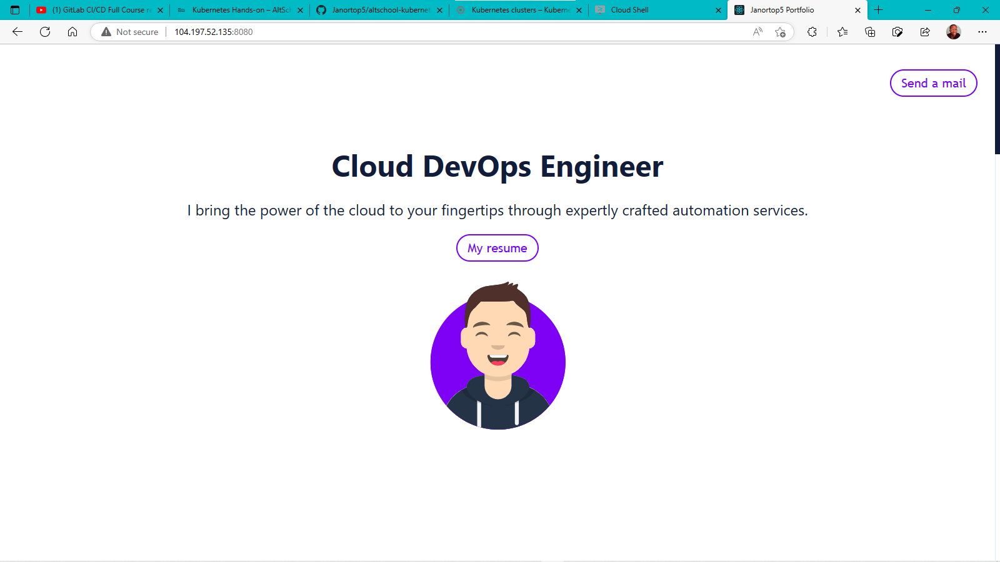
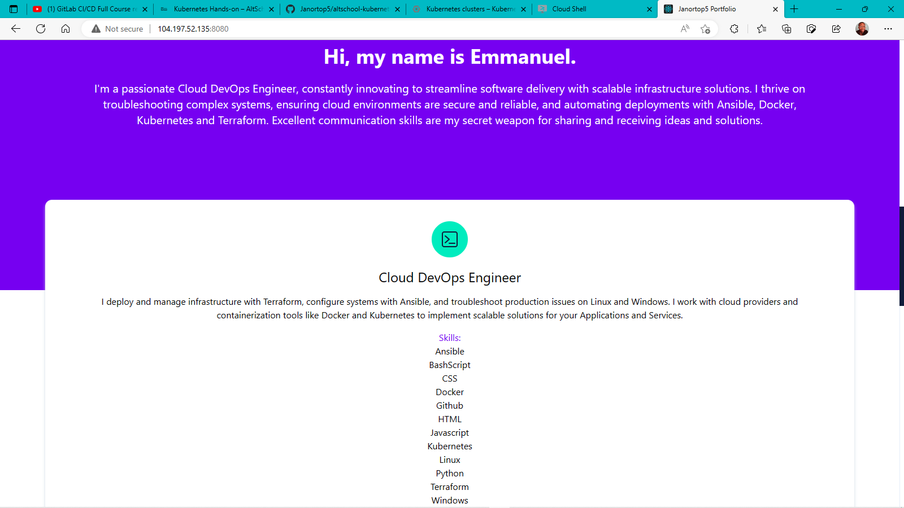

# altschool-kubernetes-mini-project
Kubernetes deployment of portfolio website on GCP. Portfolio image being built from Dockerfile, based off Nginx image and published to Docker registry.

### portfolio_image/
- Dockerfile to build the portfolio image.
- Source files and other files the Dockerfile and image needs.

### portfolio.yml
- New "portfolio" namespace for portfolio deployment.
- Deployment for portfolio.
- LoadBalancer Service for portfolio deployment.

## Install
### Setup
Build docker image
```
cd portfolio_image/
docker build -t janortop5/portfolio .
```
Login to Dockerhub account
```
docker login
```
Push image to Dockerhub
```
docker push janortop5/portfolio
```
### Deploy
Create kubernetes components <br>
in ./
```
kubectl create -f portfolio.yml
```

### Screenshot of Deployed Website





